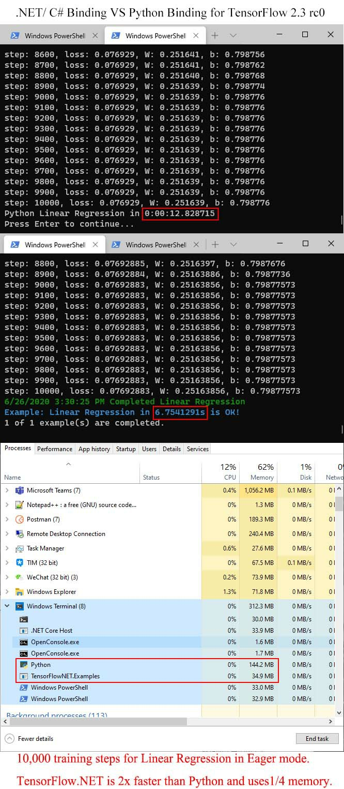

# 介绍

## 凭啥选 C# 和 F# 版本的？

长得很像啊，几乎没学习难度：


用了这个项目，你就可以在 C# 和 F# 项目上跑机器学习了。

<video style="width: 100%;" src="_media/csharp-vs-python-speed.mp4" type="video/mp4" controls autoplay loop>python vs csharp on speed</video>

> 毫无悬念， .NET 版本 (左边那个) 完爆 python 版本 (右边那个). 👆 用 TensorFlow SGD 跑 1 万次循环的线性回归. (CPU)



> TensorFlow.NET 有 2x 速度和 1/4 空间占用相比较 python 版. (TensorFlow.NET 0.20-preview2)

举个例子， [TensorFlowSharp](https://www.nuget.org/packages/TensorFlowSharp/) 需要在 python 层之上跑 C# 代码，不够高效。但是 [TF.NET](https://github.com/SciSharp/TensorFlow.NET) 就直接跟 Tensorflow 的 C++ API 打交道，够快！

| TensorFlow                 | tf native1.14 | tf native 1.15 | tf native 2.3 |
| -------------------------- | ------------- | -------------- | ------------- |
| tf.net 0.3x, tf.keras 0.2  |               |                | x             |
| tf.net 0.2x                |               | x              | x             |
| tf.net 0.15                | x             | x              |               |
| tf.net 0.14                | x             |                |               |

## 快速入门

[记得先安装依赖包](zh-cn/essentials/installation.md)

### C# 例子

将 TF.NET 和 Keras API 导入到你的项目内：

```csharp
using static Tensorflow.Binding;
using static Tensorflow.KerasApi;
```

线性回归（Linear Regression）：

```csharp
// Parameters        
var training_steps = 1000;
var learning_rate = 0.01f;
var display_step = 100;

// Sample data
var train_X = np.array(3.3f, 4.4f, 5.5f, 6.71f, 6.93f, 4.168f, 9.779f, 6.182f, 7.59f, 2.167f,
             7.042f, 10.791f, 5.313f, 7.997f, 5.654f, 9.27f, 3.1f);
var train_Y = np.array(1.7f, 2.76f, 2.09f, 3.19f, 1.694f, 1.573f, 3.366f, 2.596f, 2.53f, 1.221f,
             2.827f, 3.465f, 1.65f, 2.904f, 2.42f, 2.94f, 1.3f);
var n_samples = train_X.shape[0];

// We can set a fixed init value in order to demo
var W = tf.Variable(-0.06f, name: "weight");
var b = tf.Variable(-0.73f, name: "bias");
var optimizer = tf.optimizers.SGD(learning_rate);

// Run training for the given number of steps.
foreach (var step in range(1, training_steps + 1))
{
    // Run the optimization to update W and b values.
    // Wrap computation inside a GradientTape for automatic differentiation.
    using var g = tf.GradientTape();
    // Linear regression (Wx + b).
    var pred = W * X + b;
    // Mean square error.
    var loss = tf.reduce_sum(tf.pow(pred - Y, 2)) / (2 * n_samples);
    // should stop recording
    // Compute gradients.
    var gradients = g.gradient(loss, (W, b));

    // Update W and b following gradients.
    optimizer.apply_gradients(zip(gradients, (W, b)));

    if (step % display_step == 0)
    {
        pred = W * X + b;
        loss = tf.reduce_sum(tf.pow(pred - Y, 2)) / (2 * n_samples);
        print($"step: {step}, loss: {loss.numpy()}, W: {W.numpy()}, b: {b.numpy()}");
    }
}
```

用 `Keras` 的 API 试试简单的 `ResNet`：

```csharp
// input layer
var inputs = keras.Input(shape: (32, 32, 3), name: "img");

// convolutional layer
var x = layers.Conv2D(32, 3, activation: "relu").Apply(inputs);
x = layers.Conv2D(64, 3, activation: "relu").Apply(x);
var block_1_output = layers.MaxPooling2D(3).Apply(x);

x = layers.Conv2D(64, 3, activation: "relu", padding: "same").Apply(block_1_output);
x = layers.Conv2D(64, 3, activation: "relu", padding: "same").Apply(x);
var block_2_output = layers.add(x, block_1_output);

x = layers.Conv2D(64, 3, activation: "relu", padding: "same").Apply(block_2_output);
x = layers.Conv2D(64, 3, activation: "relu", padding: "same").Apply(x);
var block_3_output = layers.add(x, block_2_output);

x = layers.Conv2D(64, 3, activation: "relu").Apply(block_3_output);
x = layers.GlobalAveragePooling2D().Apply(x);
x = layers.Dense(256, activation: "relu").Apply(x);
x = layers.Dropout(0.5f).Apply(x);

// output layer
var outputs = layers.Dense(10).Apply(x);

// build keras model
model = keras.Model(inputs, outputs, name: "toy_resnet");
model.summary();

// compile keras model in tensorflow static graph
model.compile(optimizer: keras.optimizers.RMSprop(1e-3f),
	loss: keras.losses.CategoricalCrossentropy(from_logits: true),
	metrics: new[] { "acc" });

// prepare dataset
var ((x_train, y_train), (x_test, y_test)) = keras.datasets.cifar10.load_data();

// training
model.fit(x_train[new Slice(0, 1000)], y_train[new Slice(0, 1000)], 
          batch_size: 64, 
          epochs: 10, 
          validation_split: 0.2f);
```

### F# 例子

线性回归（Linear Regression）：

```fsharp
#r "nuget: TensorFlow.Net"
#r "nuget: TensorFlow.Keras"
#r "nuget: SciSharp.TensorFlow.Redist"
#r "nuget: NumSharp"

open NumSharp
open Tensorflow
open type Tensorflow.Binding
open type Tensorflow.KerasApi

let tf = New<tensorflow>()
tf.enable_eager_execution()

// Parameters
let training_steps = 1000
let learning_rate = 0.01f
let display_step = 100

// Sample data
let train_X = 
    np.array(3.3f, 4.4f, 5.5f, 6.71f, 6.93f, 4.168f, 9.779f, 6.182f, 7.59f, 2.167f,
             7.042f, 10.791f, 5.313f, 7.997f, 5.654f, 9.27f, 3.1f)
let train_Y = 
    np.array(1.7f, 2.76f, 2.09f, 3.19f, 1.694f, 1.573f, 3.366f, 2.596f, 2.53f, 1.221f,
             2.827f, 3.465f, 1.65f, 2.904f, 2.42f, 2.94f, 1.3f)
let n_samples = train_X.shape.[0]

// We can set a fixed init value in order to demo
let W = tf.Variable(-0.06f,name = "weight")
let b = tf.Variable(-0.73f, name = "bias")
let optimizer = keras.optimizers.SGD(learning_rate)

// Run training for the given number of steps.
for step = 1 to  (training_steps + 1) do 
    // Run the optimization to update W and b values.
    // Wrap computation inside a GradientTape for automatic differentiation.
    use g = tf.GradientTape()
    // Linear regression (Wx + b).
    let pred = W * train_X + b
    // Mean square error.
    let loss = tf.reduce_sum(tf.pow(pred - train_Y,2)) / (2 * n_samples)
    // should stop recording
    // compute gradients
    let gradients = g.gradient(loss,struct (W,b))

    // Update W and b following gradients.
    optimizer.apply_gradients(zip(gradients, struct (W,b)))

    if (step % display_step) = 0 then
        let pred = W * train_X + b
        let loss = tf.reduce_sum(tf.pow(pred-train_Y,2)) / (2 * n_samples)
        printfn $"step: {step}, loss: {loss.numpy()}, W: {W.numpy()}, b: {b.numpy()}"
```

## 整点别的文档

想了解点更多细节玩法？试试这个 [C# TensorFlow 2 入门教程](https://github.com/SciSharp/TensorFlow.NET-Tutorials)。
不够刺激，想来整点英文的？ 到这里 [The Definitive Guide to Tensorflow.NET（英文）](https://tensorflownet.readthedocs.io/en/latest/FrontCover.html)。

## 直接上代码

没问题，[点这里](https://github.com/SciSharp/SciSharp-Stack-Examples)马上有！
